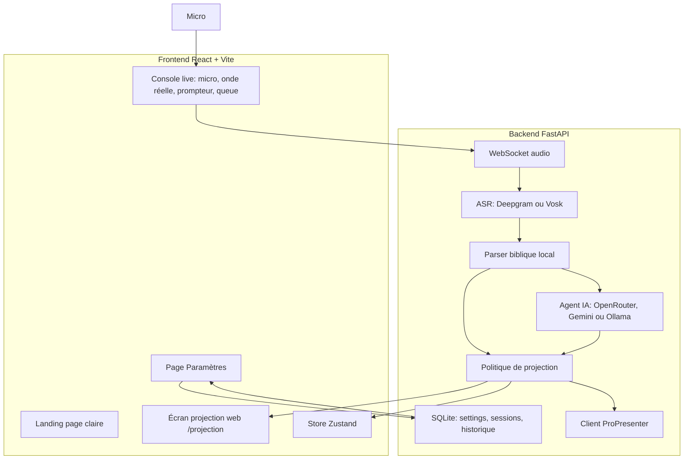
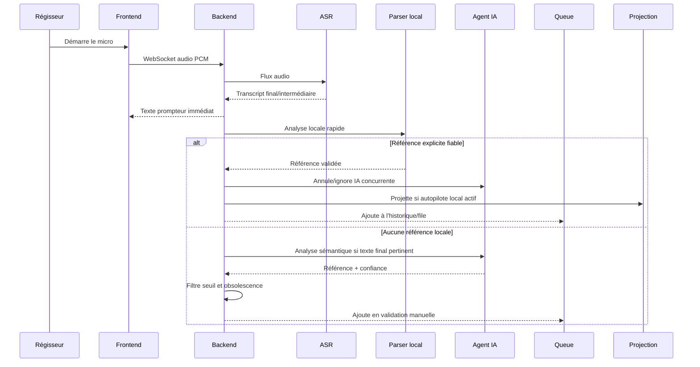

# Explication architecture - VersePro V2 actuelle

Ce document décrit l'état réel de VersePro V2 après intégration du plan critique : simplification pour bénévoles, garde-fous anti-erreur en direct, interface claire, et séparation stricte entre suggestions IA et projection.

## Intention produit

VersePro est pensé pour le régisseur bénévole du dimanche matin, pas pour un développeur. L'application doit donc :

- démarrer sans commandes complexes ;
- afficher un état lisible et rassurant ;
- éviter qu'une IA projette une référence incertaine ;
- rester utile même si Internet, Deepgram ou ProPresenter ne sont pas prêts ;
- donner au régisseur une validation humaine rapide.

La V2 actuelle n'est pas encore un installeur natif final, mais elle a maintenant un lanceur local autonome et une page Paramètres qui retirent l'essentiel de la friction terminal.

## Vue système



## Frontend

Le frontend est une application React structurée autour de trois surfaces principales.

### Landing

La landing est visuelle, claire et proche des références fournies : bleu clair, verre doux, cartes modernes, typographie très lisible. Elle sert à vendre l'expérience, pas à simuler la console live.

### Console live

La console live contient le vrai outil :

- bouton micro central ;
- onde audio calculée depuis le buffer micro réel ;
- niveau sonore dynamique ;
- prompteur avec fondu haut/bas ;
- statut serveur, IA et ProPresenter ;
- modes Autopilote local et Validation manuelle ;
- requête manuelle de référence ;
- file de projection avec accepter / rejeter.

Les anciennes sensations de panneau sombre debug ont été remplacées par une interface claire, bleue, douce, cohérente avec la landing.

### Paramètres

La page Paramètres centralise ce qui était auparavant trop technique :

- version biblique ;
- ProPresenter host/port ;
- modèle Deepgram ;
- langue ASR ;
- clés Deepgram, OpenRouter et Gemini ;
- activation de l'agent IA ;
- seuil de confiance IA.

Les secrets sont traités prudemment : le backend accepte de nouvelles clés, mais ne renvoie au navigateur que des indicateurs `configured` et des indices masqués.

## Backend

Le backend FastAPI expose :

- `/health` et `/api/v1/health` pour l'état ;
- `/api/v1/settings` pour lire et modifier la configuration runtime ;
- `/api/v1/references/parse` pour tester le parser ;
- `/api/v1/references/send` pour envoyer manuellement ;
- `/api/v1/history/*` pour sessions et historique ;
- `/projection` et `/ws/projection` pour l'écran de projection autonome ;
- `/ws/audio` pour le flux micro.

SQLite conserve les réglages, sessions, transcriptions, références, source de détection et score de confiance.

## Pipeline temps réel



## Politique anti-erreur en direct

Le coeur du plan critique est dans la politique de projection.

| Cas | Décision |
| --- | --- |
| Référence explicite locale, valide, confiance >= 0.95 | Peut être projetée automatiquement si l'autopilote est activé |
| Référence locale mais incomplète/floue | File manuelle |
| Suggestion IA | File manuelle uniquement |
| Suggestion IA sous le seuil configuré | Rejet |
| Suggestion IA arrivée après une détection locale plus récente | Ignorée |
| Détection locale forte pendant une requête IA | Tâche IA annulée si possible |

Cela règle la principale critique : l'IA n'est pas le pilote de l'écran. Elle est un copilote de proposition.

## Agent IA

L'agent IA peut utiliser trois chemins :

1. OpenRouter avec `google/gemini-2.5-flash`.
2. Gemini direct avec `gemini-2.0-flash`.
3. Ollama local avec `llama3.1:8b`.

La sortie attendue est strictement structurée :

```json
{
  "reference": "Jean 3:16",
  "confidence": 98
}
```

Le backend applique ensuite :

- parsing de la référence renvoyée par l'IA ;
- seuil minimal, par défaut `95%` ;
- marquage `source = "ai"` ;
- `detection_method = "ai_semantic"` ;
- `requires_review = true` ;
- `projection_policy = "manual_review"`.

## ASR et audio

Deux moteurs sont disponibles :

- Deepgram pour le cloud rapide ;
- Vosk pour le local hors-ligne.

Côté navigateur, le flux audio est préparé avant envoi :

- acquisition micro ;
- filtrage vocal ;
- conversion PCM ;
- downsampling ;
- calcul de volume ;
- génération de l'onde réelle affichée dans l'interface.

L'onde n'est donc plus décorative : elle reflète le signal reçu.

## ProPresenter et projection web

VersePro peut envoyer un verset à ProPresenter via le service backend. En parallèle, l'écran `/projection` fournit une projection web autonome, utile pour tester ou pour les installations sans ProPresenter.

Le bouton manuel et les actions de queue restent disponibles même si ProPresenter est déconnecté. Le régisseur peut donc préparer, vérifier et corriger sans perdre le fil.

## Démarrage et exploitation

Les lanceurs sont maintenant conçus pour réduire le stress :

- `start.sh` pour macOS/Linux ;
- `Lancer VersePro.command` pour double-clic macOS ;
- `start.bat` pour Windows.

Ils créent l'environnement local si nécessaire, installent les dépendances manquantes, démarrent backend et frontend, ouvrent le navigateur et écrivent les logs dans `v2/logs`.

Point volontairement important : le lanceur ne tue plus les applications qui occupent les ports. Il réutilise un backend VersePro sain ou demande explicitement un autre port.

## Observabilité

Les événements importants sont stockés :

- référence ;
- livre, chapitre, versets ;
- source `local` ou `ai` ;
- confiance ;
- session ;
- contexte de transcription ;
- validation manuelle.

Les logs de configuration masquent les clés API pour éviter de laisser des secrets dans les fichiers de diagnostic.

## Limites actuelles et prochaines innovations

La V2 actuelle est solide pour un usage local, mais le niveau "produit public" demande encore :

- packaging Tauri ou équivalent avec installeur signé ;
- assistant de premier lancement avec test micro, test ProPresenter et test IA ;
- mode répétition avec audio préenregistré pour entraîner l'équipe avant le culte ;
- calibration automatique bruit d'église / nappe musicale ;
- bouton "panic mode" pour basculer instantanément en manuel ;
- export diagnostic anonymisé pour support distant ;
- profils par église avec versions bibliques, langue, ProPresenter et seuils différents.

Ces éléments sont des innovations utiles, mais la priorité déjà intégrée est la plus critique : aucun passage incertain ne prend l'écran sans validation humaine.
