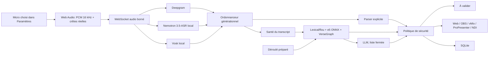

# Architecture VersePro V2

Ce document décrit le code actuel. Il sépare les garanties déjà implémentées des travaux qui exigent encore du terrain, des certificats ou un corpus audio.

## Objectif

VersePro est un instrument de régie pour bénévoles. Son architecture privilégie quatre propriétés: démarrage sans terminal dans le paquet desktop, retour d'état lisible, fonctionnement dégradé sans Internet et impossibilité pour une suggestion probabiliste de prendre l'écran seule.

## Vue d'ensemble

## Processus desktop

Tauri charge le frontend compilé et lance le backend PyInstaller sur l'interface loopback. Un secret cryptographique de 256 bits, différent à chaque lancement, est transmis au sidecar et récupéré par la WebView via une commande Tauri. Toutes les commandes HTTP et les WebSockets de contrôle doivent le présenter, même depuis `127.0.0.1`; les pages d'affichage restent publiques. Le backend utilise un dossier utilisateur inscriptible pour SQLite, modèles et journaux. Un thread Rust surveille le processus enfant toutes les deux secondes. Après un crash ou un échec de lancement, il retente avec un backoff plafonné à trente secondes; à la fermeture, il marque l'arrêt volontaire, tue puis attend le processus enfant.

La WebView utilise une CSP explicite. Elle peut charger les ressources locales, créer le blob de l'AudioWorklet et joindre uniquement le backend local. L'animation d'ouverture est muette dans le navigateur et conserve sa piste sonore dans l'application Tauri.

## Connexions frontend

La santé du serveur et la session audio sont deux états différents:

- `GET /api/v1/health` est sondé toutes les cinq secondes;
- `/ws/audio` ne s'ouvre que lorsque l'opérateur démarre le micro;
- l'arrêt du micro ferme la socket et libère le moteur cloud;
- une coupure pendant le direct déclenche un backoff de 750 ms à 30 s, limité à huit tentatives;
- hors direct, aucune boucle de reconnexion WebSocket ne consomme de quota.

Le store Zustand conserve les états opérateur. Le choix micro, le filtre et le moteur se font dans Paramètres. Le live ne garde que niveau, micro, préflight, sorties, validation et arrêt d'urgence.

## Audio et ASR

L'AudioWorklet agrège les échantillons, calcule le RMS, extrait 64 crêtes pour l'onde et convertit en PCM mono 16 kHz. Le signal brut est le défaut. Les profils `speech` et `church` utilisent respectivement 80-8000 Hz et 120-7000 Hz; aucun filtre 250-3000 Hz destructif n'est imposé.

Deepgram traite le streaming cloud. `NemotronService` fournit le chemin local
principal avec le modèle Nemotron 3.5-ASR 0.6B GGUF et la bibliothèque native
`transcribe.cpp`. Il émet des partiels puis clôt un énoncé sur pause afin que la
cascade ne reste pas bloquée sur une phrase interminable. Vosk conserve un
chemin local continu de secours. Un modèle absent n'est jamais téléchargé au
démarrage ou en plein direct.

Il n'existe plus de barrière VAD avant l'ASR. Elle a été retirée après avoir
bloqué un enregistrement réel comportant musique et prière collective. La
classe `SanteTranscription` observe plutôt les transcriptions finales : moins de
6 mots ne suffisent pas à une déduction sémantique et une moyenne inférieure à
10 mots sur les segments récents suspend les propositions profondes. Le parser
explicite continue de fonctionner. Cette mesure est un garde-fou empirique, pas
une preuve universelle de qualité acoustique.

## Ordonnancement temps réel

La queue de transcripts contient au plus 64 éléments. Une finale applique une vraie backpressure; un partiel devenu obsolète peut être abandonné. La persistance SQLite est sérialisée dans une queue de 128 éléments. Les tâches auxiliaires d'une session sont suivies et plafonnées.

Chaque transcript incrémente un numéro de génération. L'analyse précédente et la traduction précédente sont annulées. Après chaque attente asynchrone et juste avant une projection, le code vérifie encore la génération. Un calcul CPU déjà parti dans un thread peut finir, mais son résultat ne peut plus produire d'effet. Les écritures WebSocket passent par un verrou unique.

## Cascade de détection

### A. Référence explicite

Le parser normalise homophones, ordinaux et nombres parlés. Il gère les plages (`Éphésiens 2:8-9`, `jusqu'au verset neuf`) et choisit la référence la plus récente du buffer. Une référence valide obtient une confiance de 0,98; une forme lâche comme `lisons Jean trois seize` reste sous 0,95.

### B. Fusion locale

Le moteur lexical/flou et e5-base ONNX produisent des classements indépendants.
Les clés livre/chapitre/verset sont canonisées sans casse ni accents, puis
agrégées par Reciprocal Rank Fusion. VerseGraph peut réordonner le passage déjà
ouvert, avec un verrou qui refuse une ancre moins crédible que le meilleur
candidat global. Le résultat reste `requires_review=true`.

Le déroulé préparé est envoyé par `POST /api/v1/plan`. Il peut marquer un
candidat `au_plan` ou rendre manuel un numéro qui contredit le plan. Il ne crée
pas de référence et n'autorise pas une projection sémantique automatique.

### C. Arbitrage IA

L'IA ne reçoit que des candidats réellement présents dans le corpus. OpenRouter, Gemini ou Ollama peuvent sélectionner une entrée ou répondre `null`. Le backend revalide la sélection dans la liste, recalibre la confiance avec le score local, reparcourt le parser et impose une validation humaine. Une URL Ollama ne suffit plus à déclarer l'IA active; le serveur et le modèle doivent répondre. Aucun modèle Ollama n'est téléchargé implicitement.

## Politique de projection

| Signal | Mode sûr | Mode ombre | Automatisation explicitement autorisée |
| --- | --- | --- | --- |
| Référence explicite >= 0,95 | file manuelle | journal seulement | projection possible |
| Forme lâche ou chapitre seul | file manuelle | journal seulement | file manuelle |
| Fusion locale | file manuelle | journal seulement | file manuelle |
| IA fermée | file manuelle | journal seulement | file manuelle |

Le mode dimanche sûr est activé par défaut et interdit également l'avance automatique de lecture. `POST /api/v1/safety/panic` arrête le micro côté frontend, coupe `auto_send`, active le mode sûr, quitte le mode ombre et efface toutes les sorties.

## Préflight

`GET /api/v1/preflight` contrôle la base, le corpus, au moins un ASR, exécute une scène témoin dans le moteur de sortie, inspecte les sorties activées, l'espace disque, l'index sémantique et le gestionnaire de secrets. Avec `probe_cloud=true`, il ouvre puis ferme une vraie session Deepgram. Le frontend ajoute le contrôle du périphérique et de la permission microphone. Quatre gigaoctets libres sont exigés lorsqu'il reste des modèles à installer. Le live refuse de démarrer et ouvre le diagnostic si un contrôle critique échoue.

## Secrets et téléchargements

`SecretStore` utilise `keyring`. Au démarrage, les anciennes clés Deepgram, OpenRouter et Gemini sont transférées depuis SQLite puis supprimées seulement si le trousseau confirme l'écriture. Les logs de réglage n'incluent plus les valeurs. Sans backend de trousseau, les secrets restent dans la base locale et en mémoire.

Vosk est téléchargé vers un fichier `.part`, vérifié par SHA-256, puis extrait dans un répertoire temporaire avec protection anti-Zip-Slip avant déplacement atomique. Les modèles e5 pointent vers des révisions Hugging Face immuables et chaque ONNX/tokenizer possède un SHA-256 attendu avant remplacement atomique. Les téléchargements lourds sont déclenchés depuis Paramètres.

## Sorties

`OutputManager` diffuse une scène canonique et retourne un accusé par sortie. Le
frontend ne marque un élément de file comme projeté qu'après confirmation du
moteur navigateur. Le driver `BrowserOutput` alimente `/output`, `/stage`,
`/follow`, `/obs` et `/ws/output`. OBS peut donc utiliser une source navigateur
transparente sans ProPresenter. Les drivers ProPresenter, vMix et NDI sont des
sorties supplémentaires, pas des dépendances du coeur.

Dans le paquet desktop 2.1.8, Uvicorn est lié à `127.0.0.1`. Les pages
`/follow` et `/stage` sont donc publiques au sens applicatif mais joignables
seulement depuis le poste local. Le QR code détecte les interfaces LAN sans
ouvrir lui-même un listener réseau. Un accès téléphone fiable devra séparer les
pages publiques d'affichage des API de commande authentifiées.

## Persistance et observabilité

SQLite conserve sessions, transcript cumulé, détections, contexte, source et confiance. Le chemin de décision envoyé au frontend contient une explication opérateur. Le journal desktop du backend est écrit dans le dossier de données utilisateur.

## Tests et mesure

La suite pytest couvre parser, fusion, IA fermée, authentification locale et
distante, projection OBS, migration de secrets, cycle NDI, Nemotron, Vosk,
archives sûres et un flux distant complet `octets -> faux Deepgram ->
transcript -> parser -> référence`. Les données et modèles des tests sont
isolés du poste utilisateur. Les tests frontend couvrent notamment le micro,
le backoff, la file transactionnelle, le déroulé, l'Updater et les versets
voisins. `cargo test --locked` et `cargo check --locked` vérifient le lanceur.

État vérifié le 22 août 2026 : 313 tests backend réussis et 3 ignorés, 24 tests
frontend réussis, build Vite valide.

Le benchmark `benchmarks/run_detection_benchmark.py` importe la cascade de
production. Sur ses 30 phrases propres, il obtient 100 % de précision et de
rappel, avec un p95 de 33,87 ms. `benchmarks/replay_lab.py` rejoue les 43 cas du
corpus terrain et obtient actuellement 86,1 % d'exactitude, 89,3 % de précision,
80,7 % de rappel et un p95 de 29,6 ms. Six cas restent manqués. Le prochain
seuil scientifique est un corpus audio annoté provenant de plusieurs églises,
pas une hausse artificielle du score textuel.

## Limites honnêtes

- La signature et la notarisation nécessitent des certificats externes.
- L'Updater signé est câblé, mais sa chaîne publique dépend encore des secrets
  de signature et des artefacts publiés dans GitHub Releases.
- Nemotron exige la bibliothèque native `transcribe.cpp` et un modèle local de
  716 Mo; Vosk reste le secours si ce runtime n'est pas opérationnel.
- Les allusions narratives sans mots communs restent difficiles si le top-k local ne contient pas le bon récit.
- NDI dépend d'un runtime et d'une licence externes; OBS navigateur est la sortie locale garantie.
- Quarante-trois cas textuels de terrain ne remplacent pas plusieurs heures
  d'audio annoté provenant de salles différentes.
- L'accès mobile LAN annoncé par le QR code n'est pas encore joignable depuis
  le paquet desktop lié à loopback.

Les travaux proposés pour lever ces limites sont détaillés dans
[`ROADMAP_INNOVATIONS.md`](ROADMAP_INNOVATIONS.md).
