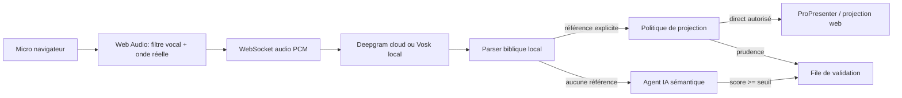

# VersePro V2

VersePro V2 est une console de régie biblique pour les cultes. Elle écoute la prédication, transcrit le son en temps réel, détecte les références bibliques explicites ou suggérées, puis aide le régisseur à projeter le bon passage dans ProPresenter ou dans l'écran de projection web intégré.

La V2 actuelle a été durcie pour un usage réel par des bénévoles : démarrage simplifié, interface claire façon verre bleu, réglages dans l'application, file de validation humaine, et agent IA strictement encadré.

## Ce que la V2 fait maintenant

- Transcription en direct avec Deepgram cloud ou Vosk local.
- Onde audio réelle calculée depuis le signal micro, pas une animation factice.
- Prompteur moderne avec fondu haut/bas pour suivre la parole reconnue.
- Parser biblique local très rapide pour les références explicites comme `Jean 3:16`.
- Agent IA sémantique en secours pour les paraphrases, avec score de confiance.
- File de projection manuelle pour vérifier avant l'écran.
- Projection directe uniquement pour les références locales explicites et très fiables.
- Page Paramètres pour gérer Bible, ProPresenter, Deepgram, IA et seuil de confiance.
- Écran de projection autonome sur `/projection`.
- Historique SQLite des sessions, références, sources et scores.

## Philosophie : Vers une Régie Sereine

Un outil destiné aux équipes de régie bénévoles ne doit pas seulement être performant : il doit être **rassurant et réduire la charge mentale** lors des moments de direct stressants. VersePro V2 traduit chaque choix d'ingénierie en bénéfices psychologiques et cognitifs pour l'opérateur :

- **Démarrage Calme** : Configuration simplifiée depuis l'application, aucun terminal requis, et gestion des ports non conflictuelle pour éliminer la panique du lancement à 5 minutes du culte.
- **Assurance Anti-Panique (Jeton d'Annulation Active)** : Le `CancellationToken` n'est pas qu'un outil réseau ; il agit comme un garde-fou. Dès que le régisseur ou le parser local valide une référence explicite, toutes les requêtes d'analyse IA asynchrones en cours sont instantanément tuées. Cela garantit qu'aucun verset erroné ne sautera à l'écran par surprise avec quelques secondes de retard.
- **Télémétrie Intuitive (L'Onde Audio Active)** : L'onde de forme multicolore n'est pas de la décoration. Elle fournit un retour d'information périphérique instantané : d'un simple coup d'œil du coin de l'œil, l'opérateur a la certitude physique que le micro capte le son, sans avoir besoin de lire de la télémétrie complexe.
- **Tri Cognitif Simplifié (Bordures Vertes et Orange)** : Les bordures lumineuses font le tri à la place de l'humain. Une bordure **verte** signale une certitude locale absolue (explicite), tandis qu'une bordure **orange** indique une suggestion sémantique de l'IA demandant une relecture. L'esprit de l'opérateur se concentre uniquement là où c'est nécessaire.
- **Tamis Sémantique Réglable** : Permet de choisir entre un mode strict pour ménager la CPU ou un mode ouvert pour capter les récits et métaphores implicites (ex: "Il a marché sur la mer").
- **Copilote Prudent** : L'IA ne prend jamais le contrôle de la projection en direct. Elle se contente de déposer des propositions triées par pertinence dans la file d'attente.

## Démarrage bénévole

Depuis le dossier `v2` :

- macOS : double-cliquer sur `Lancer VersePro.command`.
- macOS/Linux terminal : `./start.sh`.
- Windows : double-cliquer sur `start.bat`.

Au premier lancement, le script :

- crée `backend/venv` si nécessaire ;
- installe les dépendances Python ;
- installe `frontend/node_modules` si nécessaire ;
- démarre le backend FastAPI ;
- démarre l'interface React ;
- ouvre le navigateur.

Adresses par défaut :

- Interface régie : [http://127.0.0.1:3001](http://127.0.0.1:3001)
- Backend santé : [http://127.0.0.1:8001/health](http://127.0.0.1:8001/health)
- Écran projection : [http://127.0.0.1:3001/projection](http://127.0.0.1:3001/projection)

Si le port frontend `3001` est déjà occupé, le lanceur essaie automatiquement `3002`, puis les ports suivants jusqu'à `3010`.

## 🚨 Dépannage d'urgence en 2 minutes

Pas de panique ! Si l'application refuse de se lancer ou affiche une erreur, voici comment la débloquer instantanément :

### 1. "Le port de communication 8001 est occupé"
* **Pourquoi ?** VersePro est déjà en cours d'exécution en arrière-plan, ou une autre application utilise ce canal.
* **Solution** : Fermez toutes les fenêtres de terminal ouvertes et relancez le script. Si vous êtes sur Mac, vous pouvez forcer la libération des ports avec cette commande dans un terminal : `kill -9 $(lsof -t -i:8001 -i:3001)`.

### 2. Permissions macOS ("Impossible d'ouvrir le fichier car il provient d'un développeur non identifié")
* **Pourquoi ?** La sécurité de macOS bloque le double-clic sur les scripts `.command` ou `.sh`.
* **Solution** : 
  1. Ouvrez l'application **Terminal** intégrée à votre Mac.
  2. Saisissez : `chmod +x ` (avec un espace après le x).
  3. Glissez-déposez le fichier `Lancer VersePro.command` dans la fenêtre du terminal, puis appuyez sur **Entrée**.
  4. Vous pouvez maintenant double-cliquer dessus pour démarrer !

### 3. Blocage de l'installation ("npm install" ou "pip install" bloqué)
* **Pourquoi ?** Votre connexion réseau est momentanément coupée, ou un antivirus trop zélé bloque l'écriture dans le dossier virtuel.
* **Solution** : Désactivez temporairement votre antivirus le temps du premier démarrage (qui télécharge les composants essentiels), ou vérifiez votre connexion Internet. Le détail de l'erreur est consultable dans `v2/logs/install.log`.

## Paramètres intégrés

La page Paramètres permet de modifier sans terminal :

- version biblique par défaut ;
- hôte et port ProPresenter ;
- modèle et langue Deepgram ;
- clé Deepgram ;
- clés OpenRouter ou Gemini ;
- activation du copilote IA ;
- tamis sémantique réglable (Mode Strict avec filtre ou Mode Ouvert pour détection maximale) ;
- seuil de confiance minimal de l'IA ;
- mode projection directe ou validation.

Les clés déjà configurées apparaissent avec un indice masqué, par exemple `sk-o...abcd`. Elles ne sont jamais exposées en clair par l'API `/settings`.

## Règles de projection

VersePro sépare strictement détection et projection :

| Source | Condition | Résultat |
| --- | --- | --- |
| Parser local explicite | référence valide, confiance >= 95%, autopilote activé | projection directe autorisée |
| Parser local flou ou incomplet | référence valide mais prudence requise | file manuelle |
| Agent IA | score >= seuil configuré | file manuelle seulement |
| Agent IA | score < seuil | rejet silencieux |
| Réponse IA ancienne | une référence locale plus récente existe | ignorée |

Cela évite le scénario dangereux où une paraphrase mal comprise serait projetée pendant le culte.

## Architecture rapide



Voir [EXPLICATION_ARCHITECTURE.md](./EXPLICATION_ARCHITECTURE.md) pour le détail complet.

## Développement

Backend :

```bash
cd v2/backend
python3 -m venv venv
source venv/bin/activate
pip install -r requirements.txt
python3 -m uvicorn app.main:app --host 127.0.0.1 --port 8001
```

Frontend :

```bash
cd v2/frontend
npm install
VITE_BACKEND_PORT=8001 npm run dev -- --host 127.0.0.1 --port 3001
```

Tests :

```bash
cd v2/frontend
npm run build

cd ../backend
source venv/bin/activate
python3 -m compileall app
pytest
```

## Configuration avancée

Le fichier `backend/.env.example` liste toutes les variables disponibles :

- `DEEPGRAM_API_KEY`
- `GEMINI_API_KEY`
- `OPENROUTER_API_KEY`
- `AI_CONFIDENCE_THRESHOLD`
- `OLLAMA_URL`
- `PROPRESENTER_HOST`
- `PROPRESENTER_PORT`
- `BIBLE_VERSION`
- `VOSK_MODEL_TYPE`

Pour un usage normal, privilégier la page Paramètres plutôt que l'édition manuelle de `.env`.

## Reste à produire pour un vrai déploiement public

La V2 est fonctionnelle en local, mais l'étape suivante la plus importante reste un installeur signé :

- app macOS/Windows packagée ;
- icône et raccourci système ;
- mise à jour automatique ;
- vérification guidée micro, ProPresenter et Internet au premier lancement ;
- mode diagnostic exportable pour aider une équipe bénévole à distance.
